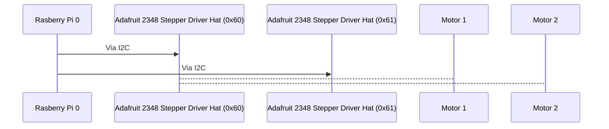

> Written with [StackEdit](https://stackedit.io/).
## Official HASE Roboterarm Dokumentation
*This is the official dokumentation for the Roboterarm Project at Humbold Academy for Science and Engeniering*

What we use:
Rasberry Pi 0 
2 Adafruit 2348 Stepper Driver Hat
4  Motors from Amazon

How it works:
We use Python to controll the Motor Drivers. The Rasberry Pi is connectet via ssh to our PC. 
The Motor Drivers are connectet to the Rasberry Pi via I2C they have the Adresses 0x60 and 0x61

